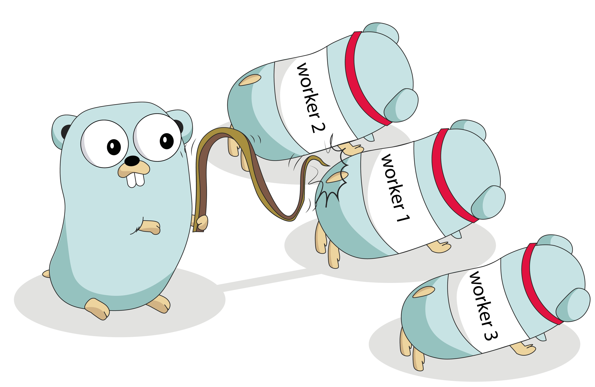

# chronicle

Chronicle allows client to register set of workers/ cron function to be triggered in defined interval of time.

## Installation
```
go get -u github.com/im-adarsh/chronicles
```
## How to use
```
package main

import (
	"context"
	"fmt"
	"time"

	"github.com/im-adarsh/chronicle"
)

func main() {

	ctx := context.Background()
	c := chronicle.NewChronicle()
	c.Register(ctx, "worker_1", time.Second*2, doTask1)
	c.Register(ctx, "worker_2", time.Second*4, doTask2)
	c.Register(ctx, "worker_3", time.Second*6, doTask3)
	c.Start()
}

func doTask1() error {
	fmt.Println("doing task 1")
	return nil
}

func doTask2() error {
	fmt.Println("doing task 2")
	return nil
}

func doTask3() error {
	fmt.Println("doing task 3")
	return nil
}

```
## Output
```
Starting 3 tasks
Starting task :  worker_3
Starting task :  worker_1
Starting task :  worker_2
[Tick worker_1] at 2021-02-18 22:29:04.064382 +0800 +08 m=+2.005346809 
doing task 1
[Tick worker_2] at 2021-02-18 22:29:06.064372 +0800 +08 m=+4.005351334 
doing task 2
[Tick worker_1] at 2021-02-18 22:29:06.064368 +0800 +08 m=+4.005347368 
doing task 1
[Tick worker_1] at 2021-02-18 22:29:08.064385 +0800 +08 m=+6.005378926 
doing task 1
[Tick worker_3] at 2021-02-18 22:29:08.064389 +0800 +08 m=+6.005382767 
doing task 3
[Tick worker_1] at 2021-02-18 22:29:10.059359 +0800 +08 m=+8.000367171 
doing task 1
[Tick worker_2] at 2021-02-18 22:29:10.059363 +0800 +08 m=+8.000370616 
doing task 2
[Tick worker_1] at 2021-02-18 22:29:12.061129 +0800 +08 m=+10.002150756 
doing task 1
[Tick worker_1] at 2021-02-18 22:29:14.061127 +0800 +08 m=+12.002162701 
doing task 1
[Tick worker_2] at 2021-02-18 22:29:14.061131 +0800 +08 m=+12.002166719 
[Tick worker_3] at 2021-02-18 22:29:14.061132 +0800 +08 m=+12.002167739 
doing task 3
doing task 2
[Tick worker_1] at 2021-02-18 22:29:16.059321 +0800 +08 m=+14.000370997 
doing task 1
[Tick worker_2] at 2021-02-18 22:29:18.059319 +0800 +08 m=+16.000383741 
doing task 2
[Tick worker_1] at 2021-02-18 22:29:18.059315 +0800 +08 m=+16.000380144 
doing task 1

```